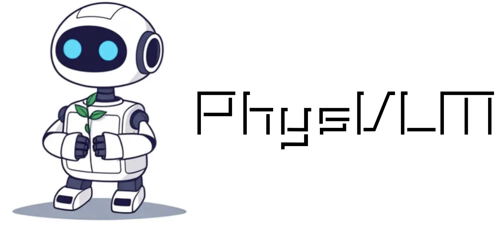
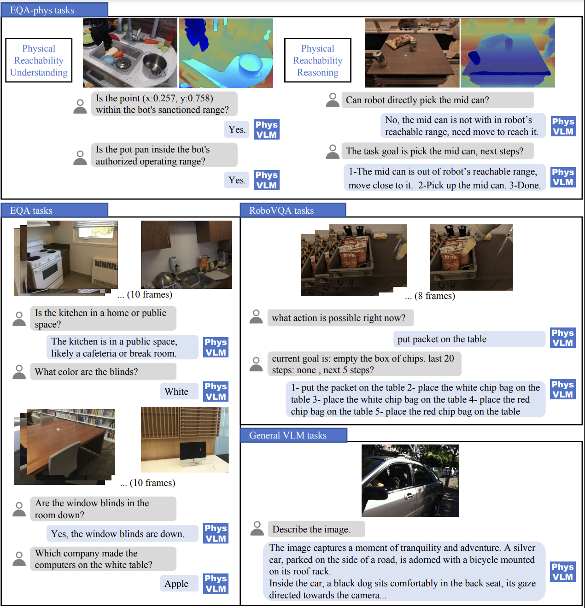

<div align=center> </div>

# Welcome to PhysVLM

</div>

📖**PhysVLM**: Enabling Visual Language Models to Understand Robotic Physical Reachability 

---

This is the official repository for PhysVLM. The goal of PhysVLM is to enable Vision-Language Models (VLMs) to understand robot reachability, with the future aim of making the action decisions generated by the model more reliable.

## Release

- [ ] Release the Phys100k-physqa dataset and the Model.
- [x] **`2025.03.12`** 🔥Paper release [`📕Arxiv`](https://arxiv.org/abs/2503.08481).
- [x] **`2025.03.12`** 🔥Release the Benchmark: [Phys-bench-sim](pybullet-main/README.md).
- [x] **`2025.02.27`** 🔥**PhysVLM has been accepted to CVPR 2025.**
- [x] 🔥Release the code of [Phys-VLM](physvlm-main/README.md).

## What can PhysVLM do now?
PhysVLM demonstrates advanced performance across reachability understanding、EmbodiedQA、VQA.



## Get Started

### 1.Clone & Install

```shell
git clone git@github.com:unira-zwj/PhysVLM.git
cd PhysVLM/physvlm-main
pip install -e .
pip install -e ".[train]"
pip install flash-attn --no-build-isolation
```

---


### 2.Download the PhysVLM models to the checkpoints folder.

| Model                              | Links                                  |
|---------                           |---------------------------------------|
| PhysVLM-3B (Ready)                 | [`🤗HuggingFace`](...)    |
---


### 3.Inference

```shell
python start_physvlm_server.py
```

then you can request the server with `(app, host="0.0.0.0", port=8001)`, example: `inference.py` or `./eval/eval_phys_bench_sim.py`

---

## Acknowledgement

- [LLaVA](https://github.com/haotian-liu/LLaVA/tree/main) provides the base codes.
- [qwen](https://github.com/QwenLM/Qwen2.5) provides the basic llm model.

## Citation
If you find PhysVLM useful for your research and applications, please cite using this BibTeX:
```bibtex
@misc{zhou2025physvlmenablingvisuallanguage,
      title={PhysVLM: Enabling Visual Language Models to Understand Robotic Physical Reachability}, 
      author={Weijie Zhou and Manli Tao and Chaoyang Zhao and Haiyun Guo and Honghui Dong and Ming Tang and Jinqiao Wang},
      year={2025},
      eprint={2503.08481},
      archivePrefix={arXiv},
      primaryClass={cs.RO},
      url={https://arxiv.org/abs/2503.08481}, 
}